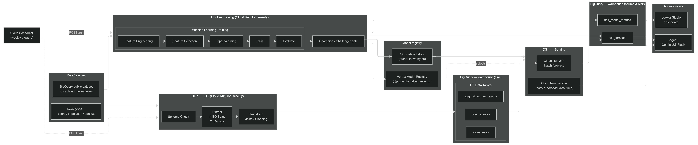
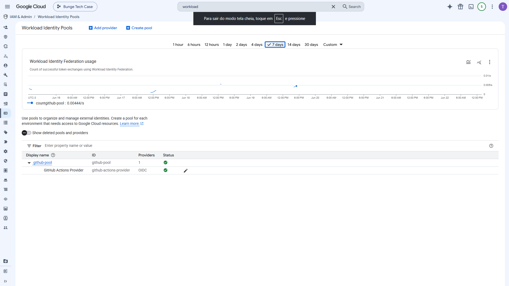
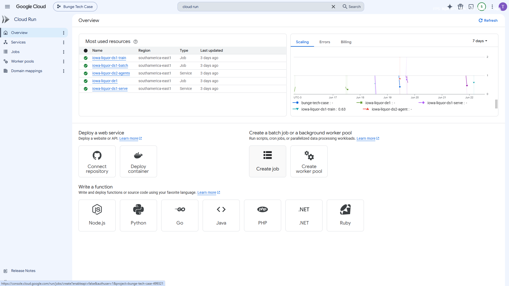
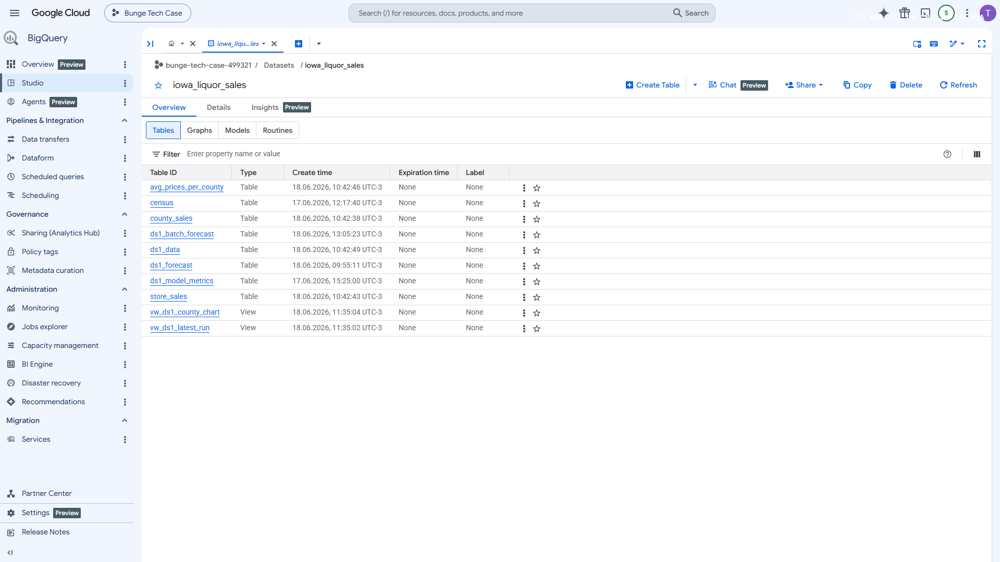

# Data Scientist | Logistics Data Manager | Product Manager

# Certificates

# Projects

## Project Spotlight #1: Iowa Liquor Sales Forecasting Platform — end-to-end on GCP

County-level monthly sales-volume forecasting, from raw public BigQuery data to a queryable forecast, a real-time API, and a conversational agent — built solo, time-boxed, and cost/quota-aware on GCP free tier.

Designed and shipped a full forecasting platform on GCP: a stateless Cloud Run ETL pipeline feeds a BigQuery warehouse, a weekly Cloud Run training job fits a global gradient-boosting model with per-county auto-detected seasonality, and forecasts are served three ways — a queryable BigQuery table, a real-time FastAPI service, and a Gemini agent. Every architecture choice was made against explicit cost/quota constraints, with a champion/challenger promotion gate keeping the production model honest.

**Highlight bullets**:

* +10.6% sMAPE over seasonal-naive (14.6% vs 16.4%, R² 0.985); one global GBM beats per-county ARIMA on 74% of 99 counties
* Leakage-safe one-step-ahead model with recursive multi-horizon forecasting and per-horizon-widened prediction intervals
* Champion/challenger promotion on a leakage-free holdout; Vertex @production alias selects, GCS stores the bytes
* DE-1 schema-drift gate halts on breaking upstream changes using a free metadata call (0 bytes scanned)
* Keyless CI/CD (GitHub OIDC → Workload Identity Federation), path-filtered redeploys, fully-mocked tests
* Two access layers: Gemini 2.5 Flash agent (fuzzy-matched BigQuery tools)

**Tech stack chips**: 

BigQuery · Cloud Run (Jobs + Service) · Vertex AI Model Registry · Cloud Scheduler · GCS · scikit-learn · Optuna · FastAPI · Gemini/Google ADK · Looker Studio · GitHub Actions

## Full Solution Diagram

## Screenshots

## Project Spotlight #2: Optimizing Last-Mile Delivery with K-Means Clustering

### Problem: Delivery scaling past fleet capacity elevated costs tremendously

In a recent project that won first place in the Supply Chain and Logistics MBA at Fundação Dom Cabral, I used K-means clustering to enhance last-mile delivery logistics. The project identifies high-density customer areas to strategically place advanced inventory locations, reducing delivery time and transportation costs.

The approach involves iterating through the K-means n_clusters hyperparameter to find the optimal number of clusters. As clusters subdivide, they eventually lose the necessary customer density. The selection criteria for the best cluster configuration focus on maximizing customer density and retaining only clusters that meet a specified minimum number of points within a defined radius. Once these optimized clusters are established, large trucks deliver to a central drop-off point, where crowdshipping takes over for final delivery.

This strategic model significantly improves delivery efficiency by reducing stops and placing inventory closer to high-demand areas, enhancing both speed and scalability for modern logistics.

**Model Results**

**Visual representation of the model working**

## Project Spotlight #3: Enhancing Warehouse Picking Productivity Evaluation with Order Complexity

### Problem: Standard metrics like Boxes/hour fail to capture productivity nuances in complex orders

Metrics such as Boxes/hour often oversimplify productivity, ignoring that more complex orders require additional time per box due to tasks like warehouse navigation and pallet assembly. To address this, I developed a Random Forest Regression model that leverages six months of data to create a "model worker" profile, representing the team’s "average" productivity for any specific order. By predicting expected picking times, this model enables a relative comparison of individual performance against historical team averages, offering a more dynamic and context-aware benchmark.

The model’s predictions were validated in partnership with supervisors, ensuring both accuracy and practical application.

**Boxplot Analysis: Time and Item Complexity Across Pickers:**
The boxplots reveal that Picker F (green) has higher picking times, which aligns with handling a greater variety of items—a known predictor of longer assembly times for complex orders. This analysis supports a nuanced evaluation of productivity, taking order complexity into account.

**Model Output:** 
Each new order receives a predicted completion time. Once the order is fulfilled, the worker’s actual time is compared to this prediction to assess performance:

*Score 0*: Worker took more than 10% longer than predicted.

*Score 1*: Worker’s time was within ±10% of the predicted time.

*Score 2*: Worker completed the order in at least 10% less time than predicted.

This scoring system enables performance classification by comparing each worker’s results against a “model” worker, created from six months of team-wide data assembling similar orders. This approach offers a consistent benchmark for individual productivity evaluation.

## Projects to Detail:

### Transportation costs breakdown by cost function integral

### Truck low productivity heatmap using tracking data clustering
